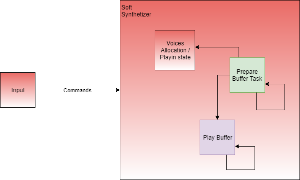

# Synthetizer architecture - Implementation notes

***Patrice Freydiere - Octobre 2019***

Synthetizer merge sounds wavforms, using some transformations, playing some tune using different instruments or sound. The raw transformation is the resampling, permitting playing the instrument sound at different notes. This synthetizer mainly use a wavtable oscillator, and designed for sequence or midi near realtime playing.

## Features

Synthetiser has currently a simple interface, very easy to use. This implementation is multithreaded, and permit using multiple tasks accessing the synthetizer.

```Pascal
  ----------
   -- Open --
   ----------
   
   --  open the synth device
   procedure Open
     (Driver_Access : Driver.Sound_Driver_Access;
      Synt :    out Synthetizer_Type;
      Buffer_Size : Natural := Natural (0.05 * 44_100.0 / 2.0);
      Buffers_Number : Positive := 1);

   
   -----------
   -- Close --
   -----------
   
   --  close the synth
   procedure Close (Synt : in out Synthetizer_Type);

   ----------
   -- Play --
   ----------

   --
   --  play a sound , on a typical frequency
   --  return the associated played channel
   --

   procedure Play
     (Synt         : Synthetizer_Type;
      S            : SoundSample;
      Frequency    : Float;
      Volume       : Float := 1.0;
      Channel : Positive := 1;
      Opened_Voice :    out Voice);


   ----------
   -- Stop --
   ----------

   --  stop the voice (or the sound associated to it)

   procedure Stop (Synt         : Synthetizer_Type;
                   Opened_Voice : Voice);

```

Synthetizer rely on a sound driver access object, which is used in sound output. The driver implementation is platform specific, and needs to be allocated and closed outside the synthetizer life cycle use. 

The synthetizer `Open` , ask for a driver properly opened, and typical buffer size and number, used for playin and ahead of playing preparation. The buffer ring is needed to lean the processing time to create the merge of all sounds. Prepare buffer used the ring to merge oscillators in a buffer result passed to the play sound buffer task.

Since v0.1.5, the synthetizer can also capable to play ahead of time, see the "AHead of Time playing" topic below. 


### Buffer considerations

Introducing buffer create a jitter between the play and command sent. Main objective in the tuning is to choose the proper buffer size to reduce the jitter time and preserve the real time behaviour of the play. If the buffer is too small, the preparing buffer task will probably not have the proper time to finish, causing 'tick' or 'claq' in the sound playing.


### Jitter choosing

Sound subsystem may also have its own buffer for rendering. And we have to discover the buffer to preserve the timing. 


### Voices

Once a command has been issued to the synthetizer `play` procedure, the synthetizer allocate a given Voice object. The voice object is a handle to the currently played sound, it can be stopped using the `stop`procedure. 

Internal definition of the voice structure is as below :

```pascal
   type Voice_Structure_Type is record
      Note_Play_Frequency          : Frequency_Type; -- the played frequency
      Play_Sample             : SoundSample; -- the sound sample to play
      Start_Play_Sample : Time;
      Stop_Play_Sample : Time := Not_Defined_Clock;
      Current_Sample_Position : Play_Second := 0.0; -- the position in second
      Volume       : Float := 1.0; -- volume factor
      Stopped : Boolean := False;
      Channel : Positive := 1; -- used for getting associated voices
   end record;
```

The voice has a SoundSample member which it the Wav file or structure, based on a base frequency, sampling frequency and associated frames array. 

Voice also remember the play frequency used for resampling and adjust the sound to play the given note. for buffering issue, the start play time and stop play time is preserved for jitter issue and permitting to has the exact rendering using large playbuffers.

### Voice Statically instanciation

Static instanciation of voice structure is done at design time, using a MAX_VOICE constant. Polyphony is based on this constant, and default to 400. Synth can have a large polyphonie, depending on the CPU processing capabilities. 

Voice Allocation / Desallocation is a bit tricky and is done using a min / max ring , permitting to not browse the entire array to allocation. Algorithm used permit to have a fast allocation, and limit the browsing for the prepare buffer task. Array construction permit to avoid CPU Memory cache misses. 


## Internal General Overview


The synthetizer has the following diagram block instance configuration:


 

Prepare Buffer task prepare the buffers that will be played, this task manage the sound, using a float description. 

Play Buffer task is responsible to convert the float sample array into sound driver specific format. (usually PCM 16 bits integer array)


### AHead of Time playing

Since **0.1.5**, synthetizer has a ahead of time event play'in. This version introduce an internal timer, permitting to stick the play / stop event in time. This timer permit to prepare events before the buffer is prepared. 

**Play** / **Stop** primitives now take a **Play_Time** and **Stop_Time** parameter to plan the voice allocation.

```
   ----------
   -- Play --
   ----------
  
   procedure Play
     (Synt         : Synthetizer_Type;
      S            : SoundSample;
      Frequency    : Float;
      Play_Time    : Synthetizer_Time;
      Volume       : Float := 1.0;
      Channel : Positive := 1;
      Opened_Voice :    out Voice);

   ----------
   -- Stop --
   ----------

   procedure Stop (Synt         : Synthetizer_Type;
                   Opened_Voice : Voice;
                   Stop_Time     : Synthetizer_Time);
```

a Synthetizer Audit Interface is setup to be aware of the next sound buffer preparation.

```
   type Synthetizer_Audit is interface;
   type Synthetizer_Audit_Access is access all Synthetizer_Audit'Class;

   procedure Ready_To_Prepare(Synth_Audit : in out Synthetizer_Audit;
                              Current_Buffer_Time,
                              Next_Buffer_Time : Synthetizer_Time) is abstract;

```

Thank's to this interface, it is now possible to prepare ahead of time,  the event to play in the next prepared buffer. 

To use this Audit interface, pass the associated reference in the **Open** procedure of the synthetizer.

```
   --  open the synth device
   procedure Open
     (Driver_Access : Driver.Sound_Driver_Access;
      Synt :    out Synthetizer_Type;
      Buffer_Size : Natural := Natural (0.05 * 44_100.0 / 2.0);
      Buffers_Number : Positive := 1;
      Audit: Synthetizer_Audit_Access := null);
```

