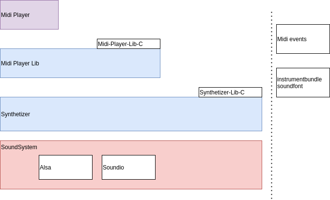

# Ada-Synthetizer Suite

*Patrice Freydiere - June 2021*


This **repository** provides a **synthetizer library implementation** for making music from samples (.wav files). A similar larger project is for example : timidity, fluidsynth. This library has been setted up to be able to handle Highly Polyphonic rendering. 

The Synthetizer takes on one side the samples, and on the other side the Notes to play. Each Wav can be reused for multiple play. 


[Example of rendering Here](http://www.barrel-organ-discovery.org/work/Record_Synth_Test_LowBandWidth_Applied.wav)  (Note : The record made is not as good as the real time rendering)

[An other example Here, using highly polyphonic use and ahead of time play'in.(since v0.1.5)](http://www.barrel-organ-discovery.org/work/2019-10_dacquin.wav)


As this library handle a simple level of synthetizer, there are no notions of instruments or sound bank yet. The core library need to be provided the individuals .wav files for each kind of sound played. Nonetheless, a first introduction of a sound bank is tested or demonstrated on the Ada-Synthetizer-Bank folder. This preview only support APrint Studio's soundbank format (instrument bundle : ie , zip with wav files in it).


A preview **Ada-Midi-Player** has been added in the repository to use the synthetizer with MIDI files, using the Ada-Midi library. For more information, go to [Ada-Midi-Player](Ada-Midi-Player) folder for more informations. Ada Midi Player is also available as a C library to use it from C compatible languages. A micropython binding is also available. The Ada Midi Player permit to control the event play, tempo change and instrument change on the fly. 


**Disclamer on possible API changes** : This library is a maturing sound engine and planned for organ and musicbox software. It is on the right path of production use. This project is opened to any contributions, or pull requests improvements. 

As an "in progress" project, API may change. An Ada Midi Player has been implemented on top of this Synthetizer, using soundbanks and givin a lot of fun.


### Current Features

The API has been tests on Windows (x86), Linux (x86 & ARM) . A conditional compilation, depending on the OS, compile the associated default driver.  

#### Sound input

- Wav File (16 bits / Signed PCM / Mono) reading

Implementing your own file format reading is possible in populating the **SoundSample** type. Additional contribution can permit to handle more input file format.

#### Synthetizer capabilities 

- Real Time Playing and Offline Playing (Ahead of time)
- The max number of voice depends on the hardware provided, there is no design limitations for the number of parallel voices, but a limit is define at compiled time and can change using the **MAX_VOICES** constant. Remind that, as the number of polyphony is increased, the processing needs to be heavier for CPU. Increasing the process buffer size may smooth the load, but increase the jitter.
- Parametrized volume for each playing sound.
- Variable output frequency, permit to adjust CPU consumption (default  44 100 Khz)

#### Current Drivers

- Win32 SoundDriver (x86), x64 supported using soundio
- Alsa SoundDriver (*nix platforms)
- soundio Library (for supporting 64 bits sound rendering on windows, and open the use for MacOs X)
- PCM 16 bit Wav Output (all platforms)


Can be extended outside the library, depending on needs. Theses drivers show how to implement one.

### Supported plateforms

The Synthetizer is tested on :

- x64, x32 desktop computers (multiple Os : linux, windows)

- ARM based processor (RPI/Orangepi/leechipi)


## Using the synthetizer : the code

Below, a 5 mins example using the **RealTime** capability of the synthetizer :


```pascal
with Synth.Driver;
with Synth.Wav;

with Synth;use Synth;
with Synth.Synthetizer;use Synth.Synthetizer;

with Ada.Text_IO;use Ada.Text_IO;


procedure Test_Play is
   Device : Driver.Sound_Driver_Access;
   Sample : SoundSample;
   S : Synthetizer_Type;
   V : Voice;

begin

   -- Default Driver, opening, using the
   -- default 44100 Khz output
   Synth.Driver.Open (Device);

   Put_Line("Load wav");
   Synth.Wav.Load(FileName => "test-files/test.wav",
                  Sample => Sample);

   Sample.Note_Frequency := MIDICode_To_Frequency(65);
   Sample.Cant_Stop := false;

   Put_Line("Open synth");

   Open(Driver_Access => Device,
        Synt => S);

   Put_Line("Play sound " & Integer'Image(Sample.Mono_Data'Length));

   for I in 0..10 loop
      Play(Synt         => S,
           S            => Sample,
           Frequency    => MIDICode_To_Frequency(65 + I),
           Opened_Voice => V);
      delay(0.3);
      Stop(S, V);
   end loop;

   delay(3.0);

   Close(Synt => S);


end;

```

More information about the API and internals can be found in the link below, especially for version v0.1.5, where a ahead of time complementary API is provided. 

[Additional technical insights can be found at this location](Ada-Synthetizer/doc/architecture.md)


## Additional sub projects

Other additional projects are bundled with the library, but optionals. These library and projects demonstrate the capabilities of the synthetizer.




## Version changes

The current version is 0.25, 

see [ChangeLog](CHANGELOG.md) for more informations about updates, changes.


## Library usage, and applications

This project is used in embedded projects (using micropython, to play), IOT project for creating ambiant sounds, and melody. 


## RoadMap


Version 0.3

- Digital Signal processing : Low / High Bandwidth filters, Compressors, Volume regulation, FadeIn / FadeOut

Mid Term Version, may be a rewrite targeting smaller footprint architectures:

- Porting to Spark profile, remove the task part for embedded usage


### Areas That can be covered next (if time permit)

Oscillators / FM generators : The current buffers are filled with Wav samples, but a short abstraction can be done to introduce signal generators and modulators to extends the use to "analog like" synthetizers.


## Contributions

Contributions are welcome, playing Midi file is really amazing, and the quality for a first shot is quite interesting, but can be improved. Any help, or efforts are welcome (testing, using , documentation ..).

