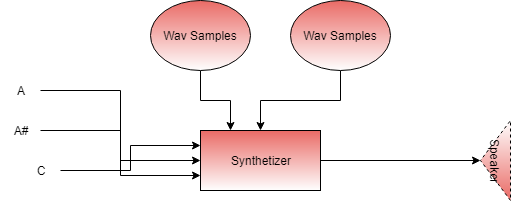

# AdaSynthetizer

*Patrice Freydiere - October 2018*


This **library** provides a **synthetizer** for making music from samples (.wav files). A similar larger project is for example : timidity. This library has been setted up to be able to handle Highly Polyphonic rendering. 

[Example of rendering Here](http://www.barrel-organ-discovery.org/work/Record_Synth_Test_LowBandWidth_Applied.wav)  (Nota : The record made is not as good as the real time rendering)


The Synthetizer takes on one side the samples, and on the other side the Notes to play. Each Wav can be reused for multiple play. 




As this library handle a simple level of synthetizer, there are no notions of instruments. These concepts can be introduced easily in a layer based on this library.


**Disclamer** : This library is still in the early stage of a sound engine for using on organ software, this is not yet ready for production. But opened to any contributions, or improvements. As a early stage project, API may change.


### Current Features

The API has been tests on Windows (x86), Linux (x86 & ARM) . A conditional compilation, depending on the OS, compile the associated default driver.  

#### Sound input

- Wav File (16 bits / Signed PCM / Mono) reading

Implementing your own file format reading is possible in populating the **SoundSample** type. Additional contribution can permit to handle more input file format.

#### Synthetizer capabilities 

- Real Time Playing and Offline Playing
- The max number of voice depends on the hardware provided, there is no hardcoded limitations, one can change the **MAX_VOICES** constant, and see whether it match the requierments. (As the number of polyphonie is increased, the processing may be heavier and can lead to increase the jitter and buffer sizes).
- Parametrized volume for each playing sound.
- Variable Output frequency, permit to adjust CPU consumption (default 44100)

#### Current Drivers

- Win32 SoundDriver (x86), x64 not yet supported
- Alsa SoundDriver (*nix platforms)
- PCM 16 bit Wav Output (all plateforms)


Can be extended outside the library, depending on needs. Theses drivers show how to implement one.


## Using the Synthetizer by example : the code

Below, an example of the use of the synthetizer in 5 mins:


```pascal
 
with Synth.Driver;
with Synth.Wav;

with Synth;use Synth;
with Synth.Synthetizer;use Synth.Synthetizer;

with Ada.Text_IO;use Ada.Text_IO;


procedure Test_Play is
   Device : Driver.Sound_Driver_Access;
   Sample : SoundSample;
   S : Synthetizer_Type;
   V : Voice;

begin

   -- Default Driver, opening, using the
   -- default 44100 Khz output
   Synth.Driver.Open (Device);

   Put_Line("Load wav");
   Synth.Wav.Load(FileName => "test-files/test.wav",
                  Sample => Sample);

   Sample.Note_Frequency := MIDICode_To_Frequency(65);
   Sample.Cant_Stop := false;

   Put_Line("Open synth");

   Open(Driver_Access => Device,
        Synt => S);

   Put_Line("Play sound " & Integer'Image(Sample.Mono_Data'Length));

   for I in 0..10 loop
      Play(Synt         => S,
           S            => Sample,
           Frequency    => MIDICode_To_Frequency(65 + I),
           Opened_Voice => V);
      delay(0.3);
      Stop(S, V);
   end loop;

   delay(3.0);

   Close(Synt => S);


end;

```

[Additional technical insights can be found at this location](doc/architecture.md)

## Feedbacks

The synthetizer behave nicely, there are no large amount or synchro between components. Playing Midi file is really amazing, and the quality for a first shot is quite interessing, but can be improved.


## Next actions

Version 0.1.1:

- ~~Fix Memory Leak for Win32 driver~~
- ~~Eval portaudio for output rendering (X Plateform sound toolkit)~~
- ~~Add Alsa Driver for linux plateforms~~
- ~~Add Wav Driver for debugging purpose or to disk exports~~

Version 0.1.2:

- x64 support, opening to x64 compatible library

Version 0.1.5

- Ahead of time playin

Version 0.2: 

- Interfaçing with C, Java for consuming the library
- x64 windows support
- Digital Signal processing : Low / High Bandwidth filters, Compressors, Volume regulation, FadeIn / FadeOut
- Lattency detection, permitting to have both online and offline playin

Mid Term Version :

- Ahead of time playin
- Porting to Spark profile, remove the task part for embedded usage


### Areas That can be covered next (if time permit)

FM generators : The current buffers are filled with Wav samples, but a short abstraction can be done to introduce signal generators and modulators to extends the use to "analog like" synthetizers.
