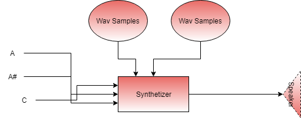

# Ada-Synthetizer Suite

*Patrice Freydiere - April 2020*

This **repository** provides a **synthetizer library implementation** for making music from samples (.wav files). A similar larger project is for example : timidity, fluidsynth. This library has been setted up to be able to handle Highly Polyphonic rendering. 

The Synthetizer takes on one side the samples, and on the other side the Notes to play. Each Wav can be reused for multiple play. 





[Example of rendering Here](http://www.barrel-organ-discovery.org/work/Record_Synth_Test_LowBandWidth_Applied.wav)  (Nota : The record made is not as good as the real time rendering)

[An other example Here, using highly polyphonic use and ahead of time play'in.(since v0.1.5)](http://www.barrel-organ-discovery.org/work/2019-10_dacquin.wav)


As this library handle a simple level of synthetizer, there are no notions of instruments or sound bank yet. The core library need to be provided the individuals .wav files for each kind of sound played. Nonetheless, a first introduction of a sound bank is tested or demonstrated on the Ada-Synthetizer-Bank folder. This preview only support APrint Studio's soundbank format (instrument bundle : ie , zip with wav files in it).


A preview **Ada-Midi-Player** has been added in the repository to use the synthetizer with MIDI Files, using the Ada-Midi library. For more information, go to [Ada-Midi-Player](Ada-Midi-Player) folder for more informations.


**Disclamer on possible API changes** : This library is a maturing sound engine and planned for organ and musicbox software. It is on the right path of production use. This project is opened to any contributions, or pull requests improvements. 

As an "in progress" project, API may change. An Ada Midi Player has been implemented on top of this Synthetizer, using soundbanks and givin a lot of fun.


### Current Features

The API has been tests on Windows (x86), Linux (x86 & ARM) . A conditional compilation, depending on the OS, compile the associated default driver.  

#### Sound input

- Wav File (16 bits / Signed PCM / Mono) reading

Implementing your own file format reading is possible in populating the **SoundSample** type. Additional contribution can permit to handle more input file format.

#### Synthetizer capabilities 

- Real Time Playing and Offline Playing
- The max number of voice depends on the hardware provided, there is no hardcoded limitations, one can change the **MAX_VOICES** constant, and see whether it match the requierments. (As the number of polyphonie is increased, the processing may be heavier and can lead to increase the jitter and buffer sizes).
- Parametrized volume for each playing sound.
- Variable Output frequency, permit to adjust CPU consumption (default 44 100 Khz)

#### Current Drivers

- Win32 SoundDriver (x86), x64 supported using soundio
- Alsa SoundDriver (*nix platforms)
- soundio Library (for supporting 64 bits sound rendering on windows, and open the use for MacOs X)
- PCM 16 bit Wav Output (all plateforms)


Can be extended outside the library, depending on needs. Theses drivers show how to implement one.

### Supported Plateforms

The Synthetizer has been tested on x64, x32 desktop computers (linux, windows, arm v6/v7)

It also works well on ARM based processor (RPI/Orangepi)


## Using the Synthetizer by example : the code

Below, an example of the 5 mins , **RealTime** use of the synthetizer :


```pascal
with Synth.Driver;
with Synth.Wav;

with Synth;use Synth;
with Synth.Synthetizer;use Synth.Synthetizer;

with Ada.Text_IO;use Ada.Text_IO;


procedure Test_Play is
   Device : Driver.Sound_Driver_Access;
   Sample : SoundSample;
   S : Synthetizer_Type;
   V : Voice;

begin

   -- Default Driver, opening, using the
   -- default 44100 Khz output
   Synth.Driver.Open (Device);

   Put_Line("Load wav");
   Synth.Wav.Load(FileName => "test-files/test.wav",
                  Sample => Sample);

   Sample.Note_Frequency := MIDICode_To_Frequency(65);
   Sample.Cant_Stop := false;

   Put_Line("Open synth");

   Open(Driver_Access => Device,
        Synt => S);

   Put_Line("Play sound " & Integer'Image(Sample.Mono_Data'Length));

   for I in 0..10 loop
      Play(Synt         => S,
           S            => Sample,
           Frequency    => MIDICode_To_Frequency(65 + I),
           Opened_Voice => V);
      delay(0.3);
      Stop(S, V);
   end loop;

   delay(3.0);

   Close(Synt => S);


end;

```

More information about the API and internals can be found in the link below, especially for version v0.1.5, where a ahead of time complementary API is provided. 

[Additional technical insights can be found at this location](Ada-Synthetizer/doc/architecture.md)


## Feedbacks

The synthetizer behave nicely, there are no large amount or synchro between components. Playing Midi file is really amazing, and the quality for a first shot is quite interessing, but can be improved. Any Help, or efforts welcome.


## Version changes

The current version is 1.2, see [ChangeLog][ChangeLog.md] for more informations about updates, and current improvments.


## Next actions

Version 0.3

- Digital Signal processing : Low / High Bandwidth filters, Compressors, Volume regulation, FadeIn / FadeOut

Mid Term Version, may be a rewrite targeting smaller footprint architectures:

- Porting to Spark profile, remove the task part for embedded usage


### Areas That can be covered next (if time permit)

Oscillators / FM generators : The current buffers are filled with Wav samples, but a short abstraction can be done to introduce signal generators and modulators to extends the use to "analog like" synthetizers.
